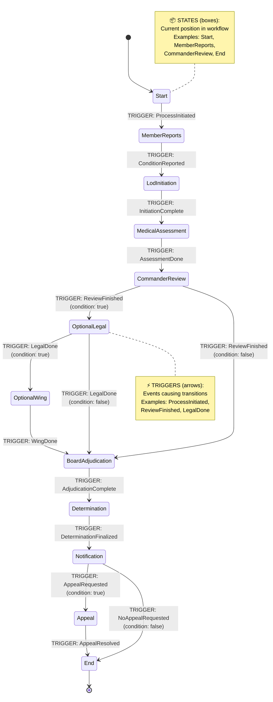

# StateMachineExperiments

A demonstration of implementing a Line of Duty (LOD) state machine using Stateless library and Entity Framework Core with SQLite for persistence.

## Overview

This project demonstrates a complete state machine implementation for managing Air Force Reserve Command (AFRC) Informal Line of Duty determination cases using:

- **Stateless**: A hierarchical state machine library for .NET
- **Entity Framework Core**: For data persistence and tracking
- **SQLite**: Lightweight database for state and transition history

## Features

-  Complete LOD workflow with configurable state transitions
-  Persistent state storage using Entity Framework Core
-  Full transition history tracking
-  Authority mapping for each state
-  Conditional branching (optional Legal/Wing reviews)
-  Resume capability - cases can be paused and resumed
-  Multiple scenario demonstrations

## State Machine Workflow



### State Machine Components

**States** (Boxes in diagram):
- `Start`, `MemberReports`, `LodInitiation`, `MedicalAssessment`
- `CommanderReview`, `OptionalLegal`, `OptionalWing`
- `BoardAdjudication`, `Determination`, `Notification`, `Appeal`, `End`

**Triggers** (Arrow labels in diagram):
- `ProcessInitiated`, `ConditionReported`, `InitiationComplete`
- `AssessmentDone`, `ReviewFinished`, `LegalDone`, `WingDone`
- `AdjudicationComplete`, `DeterminationFinalized`
- `AppealRequested`, `NoAppealRequested`, `AppealResolved`

## Getting Started

### Prerequisites

- .NET 10.0 SDK or later
- Visual Studio 2022 or VS Code

### Running the Application

```powershell
cd StateMachineExperiments
dotnet restore
dotnet run
```

### Database

The application uses SQLite and creates lod_cases.db automatically. The database schema is managed through EF Core migrations.

## Project Structure

- **Models/** - Domain entities (InformalLineOfDuty, StateTransitionHistory, Enums)
- **Services/** - Business logic (LodStateMachineService)
- **Data/** - EF Core DbContext and migrations
- **Program.cs** - Demo scenarios

## Scenarios Demonstrated

1. **Full workflow** with all optional reviews and appeal
2. **Fast-track** case without optional reviews
3. **Persistence & resumability** demonstration

## Technologies

- C# 12
- .NET 10.0
- Stateless 5.20.0
- Entity Framework Core 10.0.2
- SQLite

## License

This is a demonstration project for educational purposes.
